# 👟 FeedShop | 신발 전문 이커머스 백엔드

[](https://github.com/ECommerceCommunity/FeedShop_Backend/actions/workflows/ci.yml)
[](https://sonarcloud.io/summary/new_code?id=ECommerceCommunity_FeedShop_Backend)
[](https://sonarcloud.io/summary/new_code?id=ECommerceCommunity_FeedShop_Backend)

신발 전문 쇼핑몰 FeedShop의 백엔드 API 서버입니다. Spring Boot 3.3 기반으로 클린 아키텍처 패턴을 적용하여 구현된 현대적인 이커머스 플랫폼입니다.

- **Frontend Repository**: [FeedShop Frontend (React)](https://github.com/ECommerceCommunity/FeedShop_Frontend)
- **Live Demo**: [www.feedshop.store](https://www.feedshop.store)
- **API Documentation**: [Swagger UI](https://feedshop-springboot-561086069695.asia-northeast3.run.app/swagger-ui/index.html)

---

## 📚 목차

- [✨ 주요 기능](#-주요-기능)
- [🏗️ 아키텍처](#️-아키텍처)
- [📊 도메인별 구현 현황](#-도메인별-구현-현황)
- [🛠️ 기술 스택](#️-기술-스택)
- [🚀 시작하기](#-시작하기)
- [📖 API 문서](#-api-문서)
- [🧪 테스트](#-테스트)
- [🔧 개발 환경](#-개발-환경)
- [📈 CI/CD](#cicd)
- [🤝 기여 방법](#-기여-방법)
- [📝 라이선스](#-라이선스)

---

## ✨ 주요 기능

### 🛍️ 핵심 이커머스 기능

- **상품 관리**: 상품 등록, 수정, 삭제, 옵션 관리, 이미지 업로드
- **장바구니**: 상품 추가/삭제, 수량 변경, 선택 상품 관리
- **주문 시스템**: 주문 생성, 주문 내역 조회, 재고 관리, 포인트 사용
- **결제 연동**: 다양한 결제 수단 지원 (구현 예정)

### 👤 사용자 관리

- **JWT 기반 인증**: 토큰 기반 보안 인증
- **회원 관리**: 회원가입, 로그인, 정보 수정, 탈퇴
- **권한 관리**: 사용자/판매자/관리자 역할 기반 접근 제어
- **소셜 로그인**: OAuth2 기반 Google, Kakao 로그인
- **2FA 인증**: Google Authenticator 기반 2단계 인증

### 💬 커뮤니티 기능

- **피드 시스템**: 사용자 피드 작성, 조회, 좋아요
- **리뷰 시스템**: 상품 리뷰 작성, 조회, 평점 관리
- **이벤트 관리**: 이벤트 생성, 조회, 참여 기능

### 🎁 마케팅 기능

- **포인트 시스템**: 활동 기반 포인트 적립/사용, 만료 관리
- **쿠폰 관리**: 할인 쿠폰 발급, 사용, 관리
- **위시리스트**: 관심 상품 저장 및 관리
- **뱃지 시스템**: 활동 기반 뱃지 획득, 레벨 시스템 연동

### 🏪 스토어 관리

- **스토어 정보**: 판매자 스토어 정보 관리
- **상품 관리**: 판매자별 상품 등록 및 관리
- **주문 관리**: 판매자 주문 처리 및 배송 관리

### 🤖 AI 기능

- **상품 추천**: OpenAI 기반 개인화 상품 추천
- **AI 챗봇**: 상품 문의 및 고객 지원 (구현 예정)
- **스마트 검색**: AI 기반 상품 검색 및 필터링 (구현 예정)

---

## 🏗️ 아키텍처

### 전체 시스템 아키텍처

```mermaid
graph TB
    %% Frontend Layer
    subgraph "Frontend (Vercel)"
        FE["React Frontend<br/>🌐 www.feedshop.store"]
    end

    %% CDN & Storage
    subgraph "Static Assets"
        CDN["CDN<br/>📁 cdn-feedshop.store<br/>(Google Cloud Storage)"]
    end

    %% Backend Services
    subgraph "GCP Backend Services"
        subgraph "Development Environment"
            DEV_APP["Development API<br/>🔧 Spring Boot<br/>(Local/Dev Server)"]
            DEV_DB[(Development DB<br/>🗄️ MySQL<br/>Compute Engine + Docker)]
        end

        subgraph "Production Environment"
            PROD_APP["Production API<br/>🚀 Spring Boot<br/>Cloud Run<br/>feedshop-springboot-561086069695.asia-northeast3.run.app"]
            PROD_DB[(Production DB<br/>☁️ Cloud SQL MySQL<br/>feedshop-db)]
        end
    end

    %% External Services
    subgraph "External Services"
        MAILGUN["Mailgun<br/>📧 Email Service"]
        RECAPTCHA["Google reCAPTCHA<br/>🛡️ Bot Protection"]
        SONAR["SonarCloud<br/>📊 Code Quality"]
        OPENAI["OpenAI<br/>🤖 AI Services"]
        OAUTH["OAuth2 Providers<br/>🔐 Google, Kakao"]
    end

    %% CI/CD Pipeline
    subgraph "CI/CD Pipeline"
        GITHUB["GitHub Repository<br/>📚 Source Code"]
        GH_ACTIONS["GitHub Actions<br/>⚙️ CI/CD Pipeline"]
    end

    %% User Interactions
    USER["👤 Users"]
    DEV["👨‍💻 Developers"]

    %% Frontend Connections
    USER --> FE
    FE --> PROD_APP
    FE --> CDN

    %% Development Flow
    DEV --> GITHUB
    DEV_APP --> DEV_DB

    %% Production Flow
    PROD_APP --> PROD_DB
    PROD_APP --> CDN
    PROD_APP --> MAILGUN
    PROD_APP --> RECAPTCHA
    PROD_APP --> OPENAI
    PROD_APP --> OAUTH

    %% CI/CD Flow
    GITHUB --> GH_ACTIONS
    GH_ACTIONS --> SONAR
    GH_ACTIONS -->|Deploy to Main| PROD_APP
    GH_ACTIONS -->|Build & Test| DEV_APP

    %% Styling
    classDef frontend fill:#e1f5fe,stroke:#01579b,stroke-width:2px
    classDef backend fill:#f3e5f5,stroke:#4a148c,stroke-width:2px
    classDef database fill:#fff3e0,stroke:#e65100,stroke-width:2px
    classDef external fill:#e8f5e8,stroke:#1b5e20,stroke-width:2px
    classDef cicd fill:#fff8e1,stroke:#ff6f00,stroke-width:2px
    classDef user fill:#fce4ec,stroke:#880e4f,stroke-width:2px

    class FE frontend
    class DEV_APP,PROD_APP backend
    class DEV_DB,PROD_DB database
    class MAILGUN,RECAPTCHA,SONAR,OPENAI,OAUTH external
    class GITHUB,GH_ACTIONS cicd
    class USER,DEV user
```



### 인프라 구성 요소

| 구성 요소         | 개발 환경                       | 운영 환경                   |
| ----------------- | ------------------------------- | --------------------------- |
| **Frontend**      | Local Development               | Vercel (www.feedshop.store) |
| **Backend API**   | Local/Dev Server                | GCP Cloud Run               |
| **Database**      | MySQL (Compute Engine + Docker) | Cloud SQL MySQL             |
| **File Storage**  | Local Storage                   | Google Cloud Storage        |
| **CDN**           | -                               | cdn-feedshop.store          |
| **Email Service** | Mailgun (Dev API Key)           | Mailgun (Prod API Key)      |
| **AI Service**    | OpenAI API                      | OpenAI API                  |
| **OAuth2**        | Google, Kakao                   | Google, Kakao               |
| **Monitoring**    | -                               | GCP Logging & Monitoring    |

### 클린 아키텍처 패턴 적용

```
src/main/java/com/cMall/feedShop/
├── 📁 ai/            # AI 도메인 (상품 추천, 챗봇)
├── 📁 annotation/    # 커스텀 어노테이션
├── 📁 cart/          # 장바구니 도메인
├── 📁 common/        # 공통 컴포넌트 (설정, 유틸리티, 예외 처리)
├── 📁 config/        # 설정 클래스들
├── 📁 event/         # 이벤트 도메인
├── 📁 feed/          # 피드 도메인
├── 📁 order/         # 주문 도메인
├── 📁 product/       # 상품 도메인
├── 📁 review/        # 리뷰 도메인
├── 📁 store/         # 스토어 도메인
└── 📁 user/          # 사용자 도메인
```

### 도메인별 모듈화

- **User**: 사용자 관리, 인증, 권한, 포인트/쿠폰, 뱃지/레벨
- **Product**: 상품 관리, 카테고리, 옵션, 이미지
- **Cart**: 장바구니 관리, 선택 상품 처리
- **Order**: 주문 처리, 결제, 재고 관리
- **Review**: 리뷰 시스템, 평점 관리
- **Feed**: 소셜 피드, 좋아요, 댓글
- **Event**: 이벤트 관리, 검색, 필터링
- **Store**: 스토어 정보 관리
- **AI**: 상품 추천, AI 챗봇

---

## 📊 도메인별 구현 현황

| 도메인      | 구현 상태 | 주요 기능                                                 | 테스트 커버리지 |
| ----------- | --------- | --------------------------------------------------------- | --------------- |
| **User**    | ✅ 완료   | JWT 인증, OAuth2 소셜 로그인, 포인트/쿠폰, 뱃지/레벨, 2FA | 높음            |
| **Product** | ✅ 완료   | 상품 CRUD, 옵션 관리, 이미지 업로드                       | 높음            |
| **Cart**    | ✅ 완료   | 장바구니 관리, 선택 상품 처리                             | 높음            |
| **Order**   | ✅ 완료   | 주문 생성, 재고 관리, 포인트 사용                         | 높음            |
| **Review**  | ✅ 완료   | 리뷰 CRUD, 평점 시스템, 통계                              | 높음            |
| **Feed**    | ✅ 완료   | 피드 작성, 조회, 좋아요, 댓글                             | 높음            |
| **Event**   | ✅ 완료   | 이벤트 관리, 검색, 필터링                                 | 높음            |
| **Store**   | ✅ 완료   | 스토어 정보 관리                                          | 높음            |
| **AI**      | 🔄 진행중 | OpenAI 기반 상품 추천                                     | 중간            |

---

## 🛠️ 기술 스택

### Backend

| 기술                | 버전     | 용도                       |
| ------------------- | -------- | -------------------------- |
| **Java**            | 17       | 메인 프로그래밍 언어       |
| **Spring Boot**     | 3.3.12   | 웹 애플리케이션 프레임워크 |
| **Spring Security** | 3.3.12   | 보안 및 인증               |
| **Spring Data JPA** | 3.3.12   | 데이터 접근 계층           |
| **QueryDSL**        | 5.1.0    | 동적 쿼리 생성             |
| **JWT**             | 0.11.5   | 토큰 기반 인증             |
| **Spring AI**       | 1.0.0-M4 | AI 서비스 통합             |

### Database & Storage

| 기술                     | 용도                 |
| ------------------------ | -------------------- |
| **MySQL 8.0**            | 메인 데이터베이스    |
| **H2**                   | 테스트용 인메모리 DB |
| **Google Cloud Storage** | 파일 저장소          |

### DevOps & Quality

| 기술               | 용도             |
| ------------------ | ---------------- |
| **Gradle**         | 빌드 도구        |
| **Docker**         | 컨테이너화       |
| **GitHub Actions** | CI/CD 파이프라인 |
| **SonarCloud**     | 코드 품질 분석   |
| **Jacoco**         | 테스트 커버리지  |

### External Services

| 서비스               | 용도                  |
| -------------------- | --------------------- |
| **Mailgun**          | 이메일 발송           |
| **Google reCAPTCHA** | 봇 방지               |
| **Google Cloud SQL** | 클라우드 데이터베이스 |
| **OpenAI API**       | AI 상품 추천          |
| **Google OAuth2**    | 소셜 로그인           |
| **Kakao OAuth2**     | 소셜 로그인           |

---

## 🚀 시작하기

### 사전 요구사항

- **Java 17** 이상
- **Gradle 8.x** 이상
- **MySQL 8.0** 이상
- **Docker** (선택사항)

### 빠른 시작

1. **레포지토리 클론**

   ```bash
   git clone https://github.com/ECommerceCommunity/FeedShop_Backend.git
   cd FeedShop_Backend
   ```

2. **환경 설정**

   ```bash
   # application.properties.example을 복사하여 설정 파일 생성
   cp "src/main/resources/ application.properties.example" src/main/resources/application.properties

   # 환경 변수 설정 (필수)
   export DB_PASSWORD=your_database_password
   export JWT_SECRET=your_jwt_secret_key
   export OPENAI_API_KEY=your_openai_api_key
   export MAILGUN_API_KEY=your_mailgun_api_key
   export GOOGLE_CLIENT_ID=your_google_client_id
   export GOOGLE_CLIENT_SECRET=your_google_client_secret
   export KAKAO_CLIENT_ID=your_kakao_client_id
   export KAKAO_CLIENT_SECRET=your_kakao_client_secret
   ```

3. **데이터베이스 설정**

   ```sql
   CREATE DATABASE feedshop_db CHARACTER SET utf8mb4 COLLATE utf8mb4_unicode_ci;
   ```

4. **애플리케이션 실행**

   ```bash
   # 개발 환경
   ./gradlew bootRun

   # 또는 프로덕션 빌드
   ./gradlew build
   java -jar build/libs/FeedShop_Backend-0.0.1-SNAPSHOT.jar
   ```

### Docker 실행

```bash
# Docker Compose로 전체 환경 실행
docker-compose up -d

# 또는 개별 컨테이너 실행
docker build -t feedshop-backend .
docker run -p 8080:8080 feedshop-backend
```

---

## 📖 API 문서

애플리케이션 실행 후 다음 URL에서 API 문서를 확인할 수 있습니다:

- **Swagger UI**: [http://localhost:8080/swagger-ui/index.html](http://localhost:8080/swagger-ui/index.html)
- **OpenAPI JSON**: [http://localhost:8080/v3/api-docs](http://localhost:8080/v3/api-docs)
- **Production API**: [https://feedshop-springboot-561086069695.asia-northeast3.run.app/swagger-ui/index.html](https://feedshop-springboot-561086069695.asia-northeast3.run.app/swagger-ui/index.html)

### 주요 API 엔드포인트

| 기능         | 엔드포인트                           | 설명                        |
| ------------ | ------------------------------------ | --------------------------- |
| **인증**     | `POST /api/auth/*`                   | 로그인, 회원가입, 토큰 갱신 |
| **사용자**   | `GET/PUT /api/users/*`               | 사용자 정보 관리            |
| **상품**     | `GET /api/products/*`                | 상품 조회, 검색             |
| **장바구니** | `GET/POST/PUT/DELETE /api/cart/*`    | 장바구니 관리               |
| **주문**     | `POST/GET /api/orders/*`             | 주문 생성 및 조회           |
| **리뷰**     | `GET/POST/PUT/DELETE /api/reviews/*` | 리뷰 관리                   |
| **피드**     | `GET/POST /api/feeds/*`              | 소셜 피드                   |
| **이벤트**   | `GET /api/events/*`                  | 이벤트 조회                 |
| **AI**       | `POST /api/ai/recommendations/*`     | AI 상품 추천                |
| **포인트**   | `GET /api/users/points/*`            | 포인트 관리                 |
| **뱃지**     | `GET /api/users/badges/*`            | 뱃지 시스템                 |

---

## 🧪 테스트

### 테스트 실행

```bash
# 전체 테스트 실행
./gradlew test

# 특정 테스트 클래스 실행
./gradlew test --tests UserServiceTest

# 테스트 커버리지 리포트 생성
./gradlew jacocoTestReport
```

### 테스트 커버리지 확인

테스트 실행 후 다음 위치에서 커버리지 리포트를 확인할 수 있습니다:

- **HTML 리포트**: `build/reports/jacoco/test/html/index.html`
- **XML 리포트**: `build/reports/jacoco/test/jacocoTestReport.xml`

### 테스트 환경

- **데이터베이스**: H2 인메모리 데이터베이스
- **프로파일**: `test` 프로파일 자동 적용
- **Mock 프레임워크**: Mockito, JUnit 5 활용

---

## 🔧 개발 환경

### IDE 설정

**IntelliJ IDEA 권장 설정:**

1. **Annotation Processing 활성화**: Settings → Build Tools → Compiler → Annotation Processors
2. **QueryDSL Q클래스 자동 생성**: Gradle 빌드 시 자동 생성
3. **Lombok 플러그인**: 설치 및 활성화

### 코드 스타일

- **Java**: Google Java Style Guide 준수
- **Spring Boot**: Spring Boot 공식 가이드라인 적용
- **테스트**: Given-When-Then 패턴 사용

### 로깅

```yaml
# 개발 환경 로깅 설정
logging:
  level:
    com.cMall.feedShop: DEBUG
    org.springframework.security: DEBUG
  pattern:
    console: "%d{yyyy-MM-dd HH:mm:ss} [%thread] %-5level %logger{36} - %msg%n"
```

---

## 📈 CI/CD

### GitHub Actions 워크플로우

1. **CI Pipeline** (`.github/workflows/ci.yml`)

   - Pull Request 시 자동 실행
   - 빌드, 테스트, 코드 분석 수행
   - SonarCloud 품질 게이트 검증

2. **Jira 연동** (`.github/workflows/create-jira-issue.yml`)
   - GitHub 이슈 생성 시 Jira 태스크 자동 생성

### 배포 환경

- **개발 환경**: 로컬 개발용 설정
- **스테이징 환경**: 테스트용 클라우드 환경
- **프로덕션 환경**: Google Cloud Platform (Cloud Run)

### 모니터링

- **애플리케이션 메트릭**: Spring Boot Actuator
- **로그 관리**: 구조화된 로깅
- **성능 모니터링**: APM 도구 연동 (구현 예정)
- **시각화 대시보드**: Grafana (구현 예정)
- **클라우드 모니터링**: Google Cloud Monitoring (구현 예정)

---

## 🤝 기여 방법

### 개발 프로세스

1. **이슈 생성**: 새로운 기능이나 버그 수정 이슈 생성
2. **브랜치 생성**: `feature/기능명` 또는 `fix/버그명` 형식
3. **개발**: 로컬에서 기능 구현 및 테스트
4. **커밋**: 명확한 커밋 메시지 작성
5. **Pull Request**: 상세한 설명과 함께 PR 생성

### 커밋 메시지 규칙

```
type(scope): description

feat(user): 사용자 회원가입 기능 추가
fix(order): 주문 생성 시 재고 검증 버그 수정
refactor(product): 상품 조회 로직 개선
docs(readme): API 문서 업데이트
```

### 코드 리뷰 체크리스트

- [ ] 기능 요구사항 충족
- [ ] 테스트 코드 작성
- [ ] 코드 스타일 준수
- [ ] 보안 검토 완료
- [ ] 성능 영향 검토

---

## 📝 라이선스

이 프로젝트는 **MIT 라이선스**를 따릅니다. 자세한 내용은 [LICENSE](LICENSE) 파일을 참고하세요.

---

## 📞 문의 및 지원

- **이슈 리포트**: [GitHub Issues](https://github.com/ECommerceCommunity/FeedShop_Backend/issues)
- **기술 문서**: [Wiki](https://github.com/ECommerceCommunity/FeedShop_Backend/wiki)
- **개발자 가이드**: [개발 가이드 문서](docs/DEVELOPMENT.md)

---

<div align="center">

**FeedShop Backend Team** 🚀

_현대적인 이커머스 플랫폼을 위한 안정적이고 확장 가능한 백엔드 시스템_

</div>
